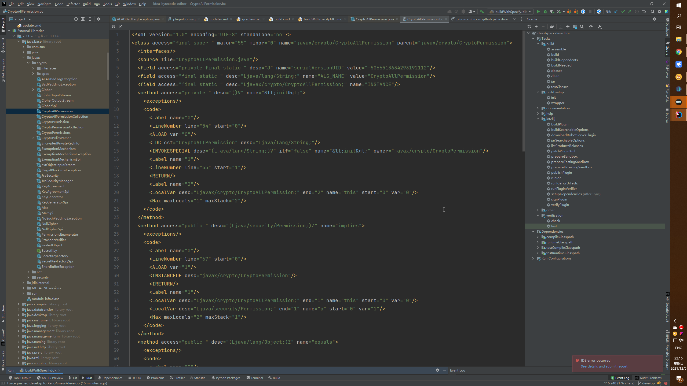
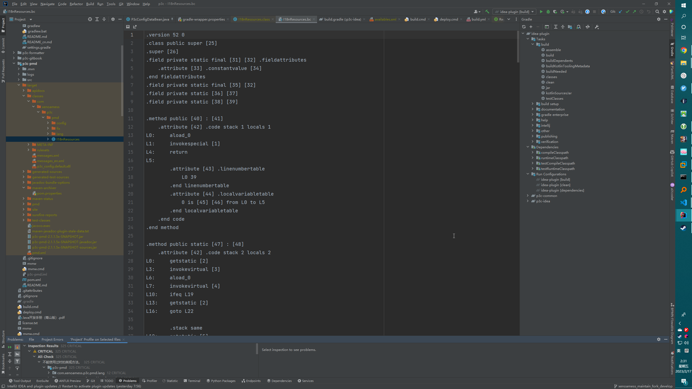

# Bytecode Editor(XenoAmess TPM)

*Third-party maintenance by XenoAmess.*

*This Third-party maintenance(TPM) here is forked from
original [pshirshov/idea-bytecode-editor](https://github.com/pshirshov/idea-bytecode-editor)*

*Follows license described in [license](https://github.com/XenoAmess/idea-bytecode-editor/blob/master/LICENSE)*

Sources can be found https://github.com/XenoAmess/idea-bytecode-editor/*

Releases can be found https://plugins.jetbrains.com/plugin/18144-bytecode-editor-xenoamess-tpm-

Provides *View | Edit Bytecode* action for those who want to edit JVM class bytecodes.

Based on ByteCode Viewer by JetBrains but is better:

- it uses an editor tab instead of a popup
- it allows you to edit bytecode assembler and assemble edited code back into .class files</li>
- it have more disassemblers/assemblers support

## Based on ASM9.2

## now support Krakatau!

It's a very gloomy tool. WIP.

TODO:

- Support for ASM Textifier representation
- Support for ASM Textifier representation assembling
- Check Jasmin compatibility with recent class file versions and rework it if required
- Representation switching
- Refactor all that shit!

Patches are welcome...
